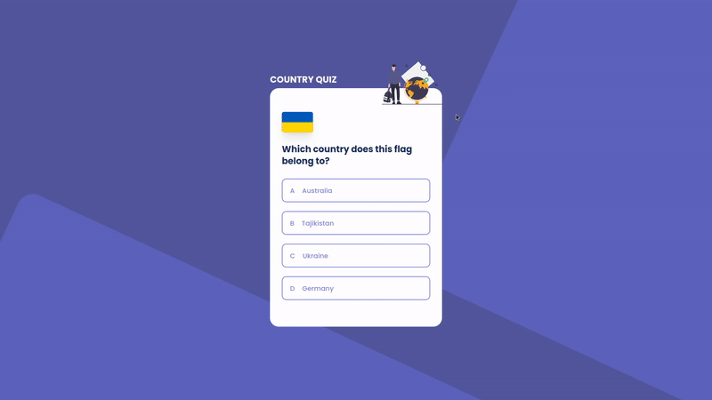

<!-- markdownlint-disable MD033 -->

<h1 align="center">
  
  Country quiz
</h1>

<div align="center">
   Solution for a challenge from  <a href="http://devchallenges.io" target="_blank">Devchallenges.io</a>.
</div>

<div align="center">
  <h3>
    <a href="https://nathan22x3.github.io/country-quiz">
      Demo
    </a>
    <span> | </span>
    <a href="https://devchallenges.io/solutions/oWSYseUP2gZCYbVEspZy">
      Solution
    </a>
    <span> | </span>
    <a href="https://devchallenges.io/challenges/Bu3G2irnaXmfwQ8sZkw8">
      Challenge
    </a>
  </h3>
</div>

<!-- TABLE OF CONTENTS -->

## Table of Contents

- [Table of Contents](#table-of-contents)
- [Overview](#overview)
  - [Built With](#built-with)
- [Features](#features)
- [How To Use](#how-to-use)
- [Plugins](#plugins)
- [Contact](#contact)

<!-- OVERVIEW -->

## Overview



### Built With

- [React](https://reactjs.org/)
- [Redux Toolkit](https://redux-toolkit.js.org/)
- [Tailwind](https://tailwindcss.com/)

## Features

This application/site was created as a submission to a [DevChallenges](https://devchallenges.io/challenges) challenge. The [challenge](https://devchallenges.io/challenges/Bu3G2irnaXmfwQ8sZkw8) was to build an application to complete the given user stories.

- [x] **User story**: You can see at 2 types of questions: a city is the capital of.. or a flag belong to country..
- [x] **User story**: You can see select an answer
- [x] **User story**: You can see if my answer is correct or incorrect
- [x] **User story**: When you answer correctly, you can move on to the next question
- [x] **User story**: When you answer incorrectly, you can see your results and try again
- [x] **User story**: You can try again

## How To Use

<!-- Example: -->

To clone and run this application, you'll need [Git](https://git-scm.com) and [Node.js](https://nodejs.org/en/download/) (which comes with [npm](http://npmjs.com)) installed on your computer. From your command line:

```bash
# Clone this repository
$ git clone https://github.com/nathan22x3/country-quiz

# Move to project directory
cd country-quiz

# Install dependencies
$ yarn

# Run the app
$ yarn start
```

## Plugins

- [twin.macro](https://github.com/ben-rogerson/twin.macro)

## Contact

- GitHub [@nathan22x3](https://github.com/nathan22x3)
